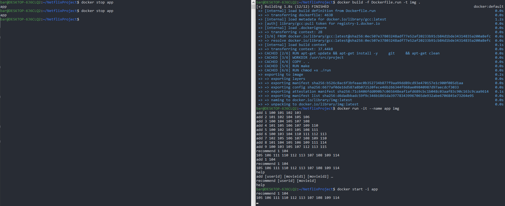

# Netflix Project
This is a Netflix project for the course "Advanced System programming" in Bar-Ilan University.

## Running the project
This project uses Docker for easy building.

To compile the project, run this command (it might take a while):
```bash
docker build -f Dockerfile.run -t img .
```
To run the project, run this:
```bash
docker run -it --name app img
```
and then you will be able to enter your input.
`app` is the name of the Docker container, and `img` is the name of the image.

If you want to stop the program, run this:
```bash
docker stop app
```

If you want to run the program again (in the same container, keeping the data from previous runs), run this:
```bash
docker start -i app
```

If you want to delete the container:
```bash
docker rm app
```

### Running our tests
We wrote some tests for the project.

To run the tests, run these two commands:
```bash
docker build -f Dockerfile.tests -t tests .
docker run tests
```

## Usage
When running the project, a Command-Line Interface starts. It supports 3 commands:
### Add
**Syntax:** `add [userid] [movieid1] [movieid2] ...`

Adds movies to a user's watched list. The user and movie IDs don't have to already exist in the system for you to use them in the command (this command also adds them to the database if they haven't already been added).

**Note:** The data is saved from run to run.

### Recommend
**Syntax:** `recommend [userid] [movieid]`

This command recommends up to 10 movies to the specified user (`userid`) based on the specified movie (`movieid`). The recommendation algorithm calculates a relevance value to each movie, excluding movies that the user already watched and the specified `movieid`. The IDs of the most relevant movies are printed in descending order of relevance.
#### The Algoritm:
Each user is assigned a "Movies in Common" (MiC) value - how many movies both them and `userid` watched. The relevance of a movie is then calculated as the sum of the MiC values of all the users who have watched both this movie and `movieid`.

### Help
**Syntax:** `help`

Displays all available commands and their syntax.

Invalid command/syntax will be ignored.

## Run Example
Here is an example of how the project compiles and runs:


Here is an example of how the tests run:

