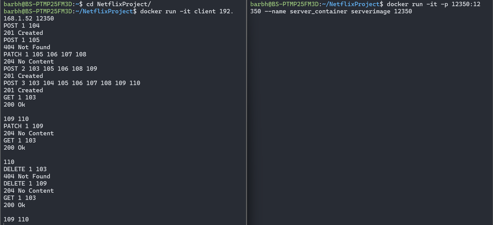
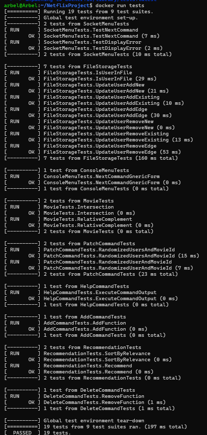

# Netflix Project
This is a Netflix project for the course "Advanced System programming" in Bar-Ilan University.
<br>
There is a server and a client. You can have as many clients as you want.

## Running the server
This project uses Docker for easy building.

To compile the server, run this command (it might take a while):
```bash
docker build -f Dockerfile.server -t serverimage .
```
To run the server, run this (replace `<PORT>` with the port number that you want the client to connect to):
```bash
docker run -it -p <PORT>:<PORT> --name server_container serverimage <PORT>
```
and then the server will be running.
`server_container` is the name of the Docker container, and `serverimage` is the name of the image.

If you want to stop the program, run this (from a different terminal):
```bash
docker stop server_container
```

If you want to run the program again (in the same container, keeping the data from previous runs), run this:
```bash
docker start -i server_container
```

If you want to delete the container:
```bash
docker rm server_container
```

## Running the client
To compile the client, run this command (it might take a while):
```bash
docker build -t client -f Dockerfile.client .
```
To run the client, run this:
```bash
docker run -it client --name client_container <SERVER_IP> <PORT>
```
Replace `<SERVER_IP>` with the IP you want your server to run on, and `<PORT>` is the same from before.
<br>
`client_container` is the name of the Docker container, and `client` is the name of the image.

If you want to stop the client, press ctrl+C, or run this (from a different terminal):
```bash
docker stop client_container
```

If you want to delete the container:
```bash
docker rm client_container
```

### Running our tests
We wrote some tests for the project.

To run the tests, run these two commands:
```bash
docker build -f Dockerfile.tests -t tests .
```
```bash
docker run tests
```

## Usage
When running the project, a command-line interface starts. It supports 5 commands:
### POST
**Syntax:** `POST [userid] [movieid1] [movieid2] ...` (supports multiple spaces)

Creates a user and adds movies to the user's watched list. The user must not already exist in the system for you to use this command on them. The movies can be either new or existing.

### PATCH
**Syntax:** `PATCH [userid] [movieid1] [movieid2] ...`

Adds movies to an existing user's watched list. The user must already exist in the system for you to use this command on them. The movies can be either new or existing.

### DELETE
**Syntax:** `DELETE [userid] [movieid1] [movieid2] ...`

Deletes movies from an existing user's watched list.

### GET
**Syntax:** `GET [userid] [movieid]`

This command recommends up to 10 movies to the specified user (`userid`) based on the specified movie (`movieid`). The recommendation algorithm calculates a relevance value to each movie, excluding movies that the user already watched and the specified `movieid`. The IDs of the most relevant movies are printed in descending order of relevance.
#### The Algoritm:
Each user is assigned a "Movies in Common" (MiC) value - how many movies both them and `userid` watched. The relevance of a movie is then calculated as the sum of the MiC values of all the users who have watched both this movie and `movieid`.

### Help
**Syntax:** `help`

Displays all available commands and their arguments.

<br>

## Run Example
Here is an example of some commands functionality and communication from the server:<br>



Here is an example of two clients working, one posts and the other one tries and fails:<br>


Here is an example of how the tests run:<br>



<br>

## Questions about ways of implemntation
* The fact that the names of the functions changed, caused us to change the code. We had to change the global vector of commands because it goes by name. In addition, we decided to turn the add command to a mother-class of the two new commands patch and post.
* The fact that new functions were added ddin't caused us to change the code, aprat from thr change mentioned above. We had an ICommand interface, we've just added the delete command.
* The fact that the output of the commands changed caused us to change the code a bit. In previous exercise we printed the ouput and now we return it as a string and send to the client (socket or terminal clients).
* The fact that the data came from sockets and not console, didn't cause us to change the code. We've created an IMenu interface and we have two classed that implements it - ConsoleMenu (previous exercise) and SocketMenu (current exercise), the app uses an IMenu object to handle request, and it unaware of the of the IMenu, so this part didn't need to be changed.
