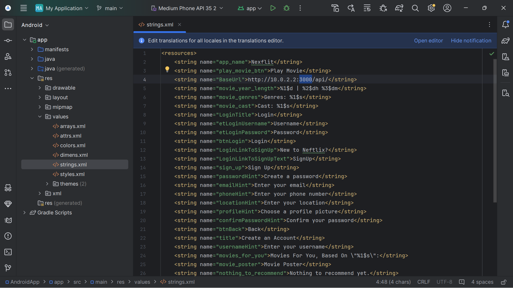

# Running The App
Before you run the app, you need to run the backend servers. Download the project's code, and see the [Web-app's HowToRun](../WebApp/HowToRun.md) for explanation on how to run the servers.

To run the app you need to follow these steps:
1. Install Android Studio.
2. Once in Android Studio, click on 'Clone Repository' and paste the repository URL.
3. Click 'Open' and choose the folder NetflixProject/src/AndroidApp.
4. Configure your emulator, we recommend 'Medium Phone'.
5. Go to the file `app/res/values/strings.xml` and change the port in this line:
`<string name="BaseUrl">http://10.0.2.2:3000/api/</string>`
from 3000 to the `WEB_PORT`, which is shown in `NetflixProject/src/WebServer/config/.env.main` (you might not even need to change anything if it is also 3000).

6. Before you start you also need to upload images and videos to the emulator, in order to add a profile picture and movies to the app. Navigate to `View -> Tool Windows -> Device Explorer`:

Now in the device explorer, navigate to sdcard/Downloads.

Now, drag and drop from the computer filesystem to the Downloads folder.

At the time of need, you should find the photos/videos in browse -> sdk.. -> Downloads.

You are now ready to add movies - Press on the Run App button:

The app is now running. Enjoy!

For further explanation about how to use the app, see [Signup&Login](Signup&Login.md).