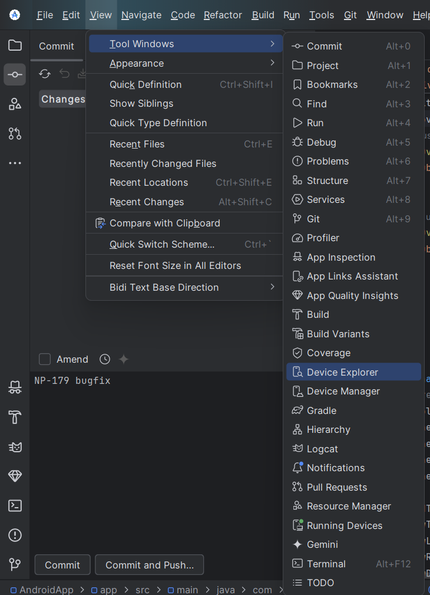
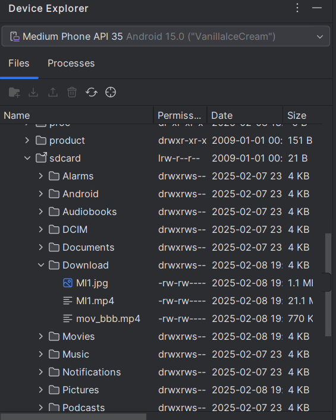
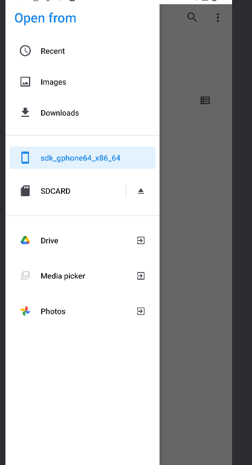
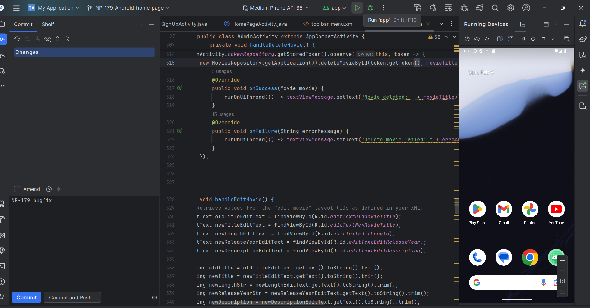

# Running The App

Download the code from GitHub, and open it in android studio.
Press 'Open' and choose the folder NetflixProject/src/AndroidApp. Configure your emulator, we recommend 'Medium Phone'.

Before you start any actions on the app, you must add videos and photos to the emulator, in order to create movies.

Navigate to View -> Tool Windows -> Device Explorer

Now in the device explorer, navigate to sdcard/Downloads.

Now, drag and drop from the computer filesystem to the Downloads folder.

At the time of need, you should find the photos/videos in browse -> sdk.. -> Downloads.

You are now ready to add movies - Press on the Run App button:

The app is now running. Enjoy!

For further explanation about how to use the app, see [Signup&Login](Signup&Login.md).