# Admins
In order to add, edit, or delete movies or categories, you must be an admin. To become an admin you need to manually change your user to an admin. To do that, open MongoDBCompass and connect to the database with your IP. Then, change the `isAdmin` field to `true`:

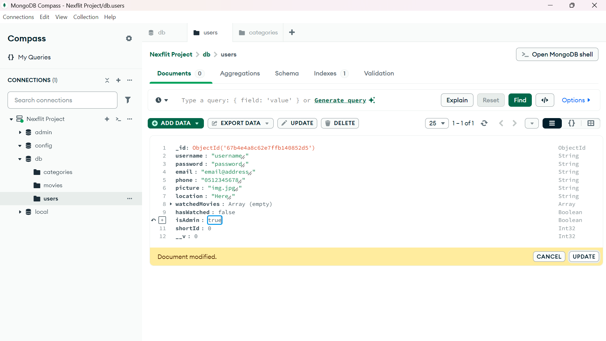

and click on 'Update'. Once you did that, you will need to re-log to the website. Press the 'logout' button to log out and be redirected back to the login screen. After you log in again you will see the 'Admin Panel' button in the top navigation bar:

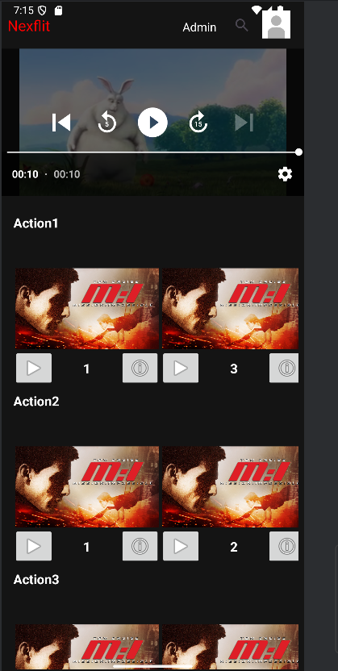

And when you click it you will be redirected to the admin panel:

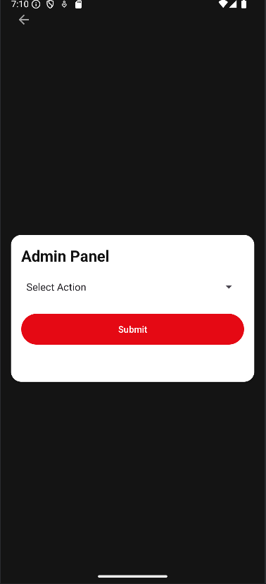

You can choose to perform any of these admin actions:

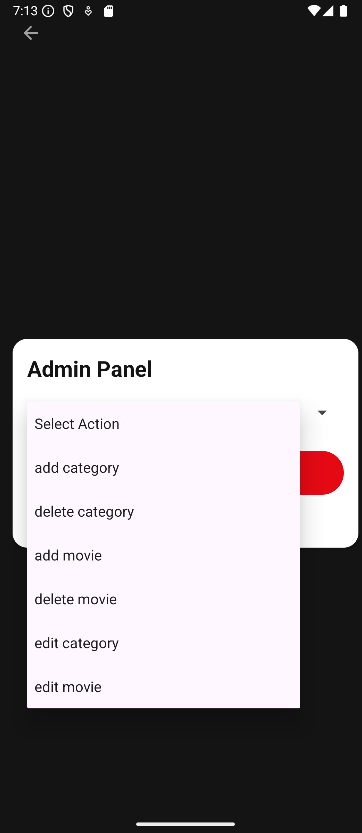

# Adding Categories and Movies
In order to add a movie, you first need to add at least one category:

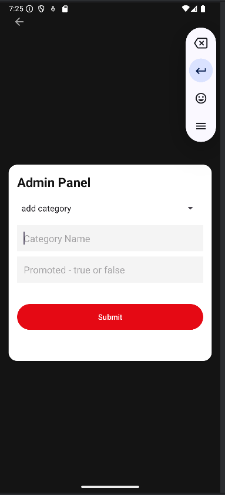

Be sure to make it promoted it you want it to appear in the home screen :)

Now we can add movies!
Choose the 'add movie' option, and fill in the details:

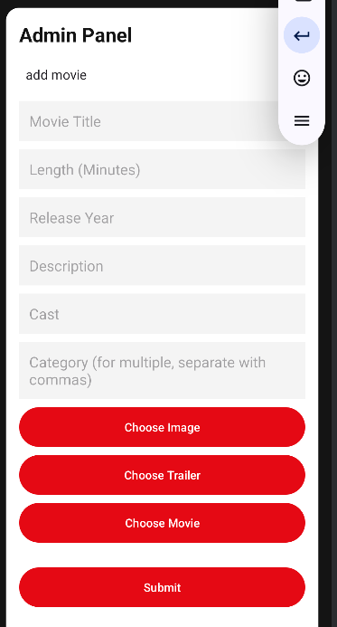

# Home Screen
We can now go back to the home screen and see our movie:

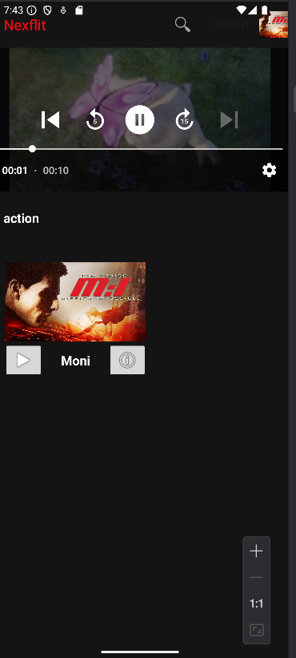

Here we'll see all of the promoted categories and their movies. The last category will be movies that you watched. Our movie is currently the only movie, so it was also chosen as the featured movie and we see its trailer at the top of the screen.

# Movie Information Screen
Now we can press the `i` on below the movie and see its trailer and info:

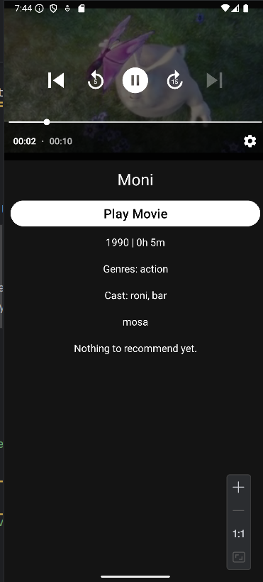

In this screen we also get recommendations, based on the movie and what other users watched. Currently there are no other users, so we do not get any recommendations.

## The Recommendation Algorithm
The recommendation algorithm calculates a relevance value to each movie, excluding movies that the user already watched and the movie that we are now looking at (in the info screen). The 10 most relevant movies are showed in descending order of relevance.
Each user is assigned a "Movies in Common" (MIC) value - how many movies both them and the logged-in user watched. The relevance of a movie is then calculated as the sum of the MIC values of all the users who have watched both that movie and the movie we're looking at.

# Movie Watch Screen
If we click the 'Play Movie' button we will be redirected to the movie screen:

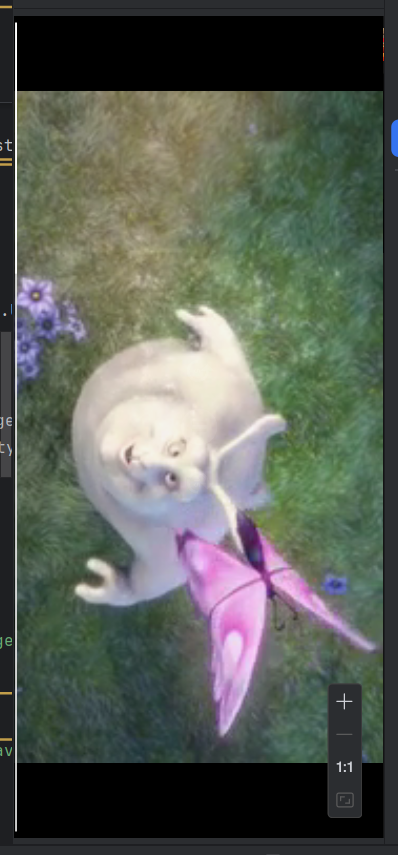

# Deleting or Editing Movies and Categories
In the Admin panel you may edit a category:

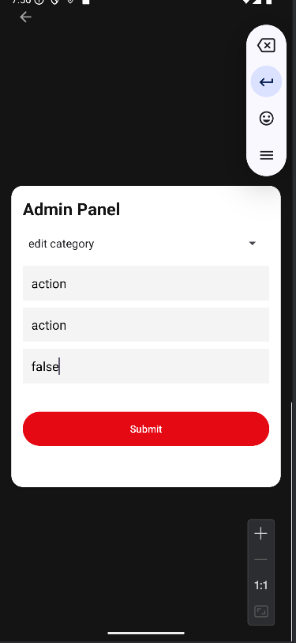

And this is how it would look like after:

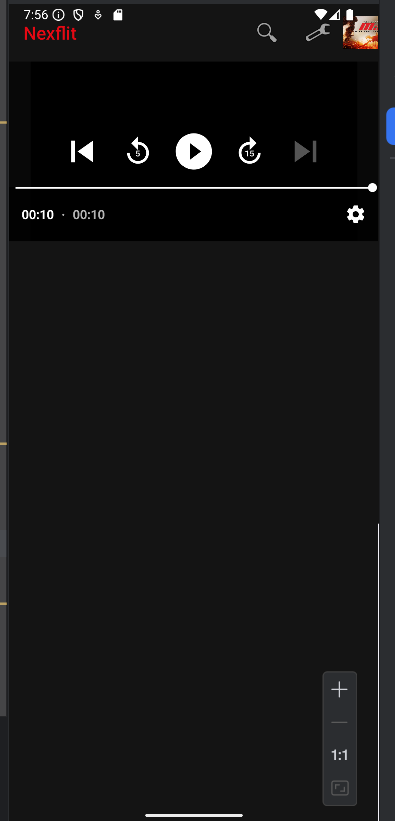

You can also delete a category or a movie:

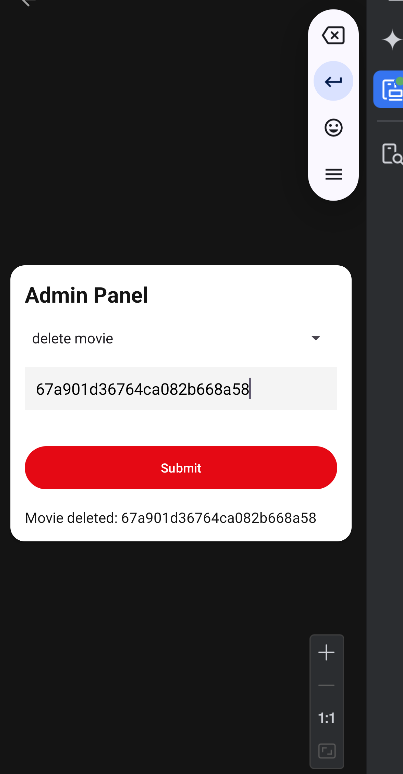

And this is how it would look:

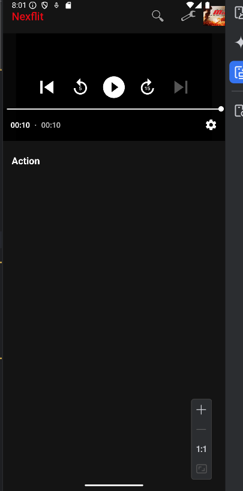

