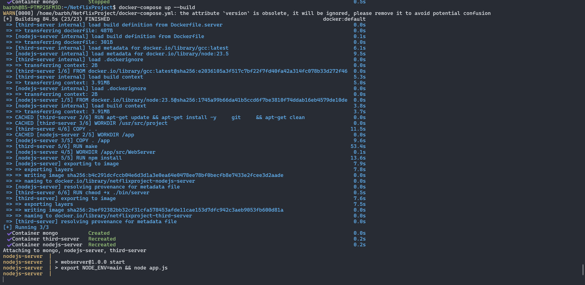

<<<<<<< HEAD
Download the code and run these commands in your terminal:
=======
After downloading the code, run these commands:
>>>>>>> main
```bash
cd ./src/WebServer/
mkdir -p config
touch config/.env.main
```
<<<<<<< HEAD
Now, go to the `.env.main` file and write the following lines:
=======
Now, inside the `.env.main` file, write the following lines:
>>>>>>> main
 ```bash
CONNECTION_STRING="mongodb://mongo:27017/db"
WEB_PORT=<PORT1>
CPP_PORT=<PORT2>
CPP_IP=<IP>
<<<<<<< HEAD
SECRET="GiveUs100"
```
Replace `<PORT1>` with the port you want the web server to run on, `<PORT2>` with the port you want the recommendation system to run on and `<IP>` with your IP. `<PORT1>` and `<PORT2>` must ofcourse be different, but also not 3000.

We use Docker for easy building.
First you need to configure the docker-compose.yml:
There are four servers:
    1. mongo
    2. nodejs
    3. recommendation server
    4. react
Each one needs a unique port.

Go to these lines, and change these two ports to the ones you chose earlier:
```bash
recommend-server:
    ...
    ports:
    - "<PORT2>:<PORT2>"

nodejs-server:
    ...
    ports:
    - "<PORT1>:<PORT1>"
```

In order to run the react client, we added to the docker-compose the react-client container. It runs on port 3000 and you must not change it.

In order to build and run the servers execute this command:
```bash
docker-compose up --build
```
It may take a few minutes.

And now the site will be available in:
```bash
http://localhost:3000
```


=======
```
And replace `<PORT1>` with the port you want the web server to run on, `<PORT2>` with the same port of the recommendation system and `<IP>` with the IP that you want the recommendation system to connect to. `<PORT1>` and `<PORT2>` must be different.

We use Docker for easy building.
First you need to configure the docker-compose.yml:
You have three servers:
    1. mongo
    2. nodejs
    3. third server
Each need a unique port, use 27017 for the mongo server.
in docker-compose.yml:
```bash
mongo:
...
ports:
- "27017:27017"
```

For the other two you are welcome to choose any free port you'd like, except from 3000, used by your react client.
```bash
third-server:
...
ports:
- "<CPP_PORT>:<CPP_PORT>"

nodejs-server:
...
ports:
- "<WEB_PORT>:<WEB_PORT>"
```

In order to build and run the servers execute the following command:
```bash
docker-compose up --build
```


>>>>>>> main
