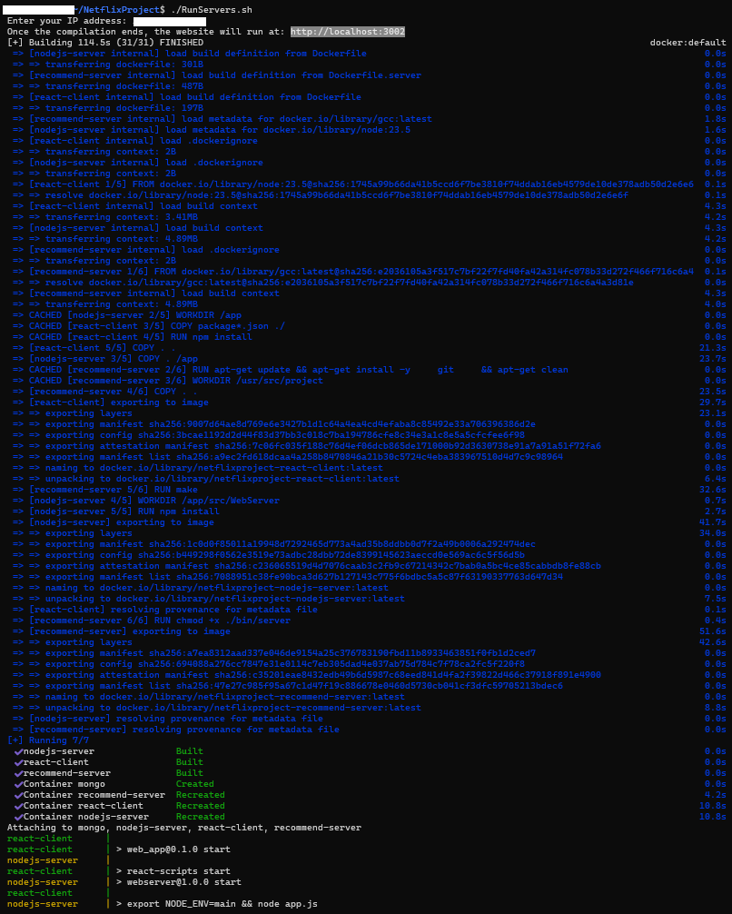

We use Docker for easy building.
Download the code, open a terminal on the folder you downloaded, and run the `RunServers.sh` file.
For Linux/MacOS:
```bash
./RunServers.sh
```
For Windows:
```bash
bash RunServers.sh
```

It will then ask for your IP address (it is needed to connect the recommendation system to the backend). After you enter it, it will print the URL of the website and compile the code. It may take a few minutes, but when it's done you can go to the URL.

The terminal should look like this when the compilation finishes:
TODO: update image


To stop the servers (stopping without deleting the users and movies you created), run:
```bash
docker-compose stop
```
and to start everything again, run:
```bash
docker-compose start
```

Enjoy!

For explanation about how to use the website, see [Signup&Login](Signup&Login.md).