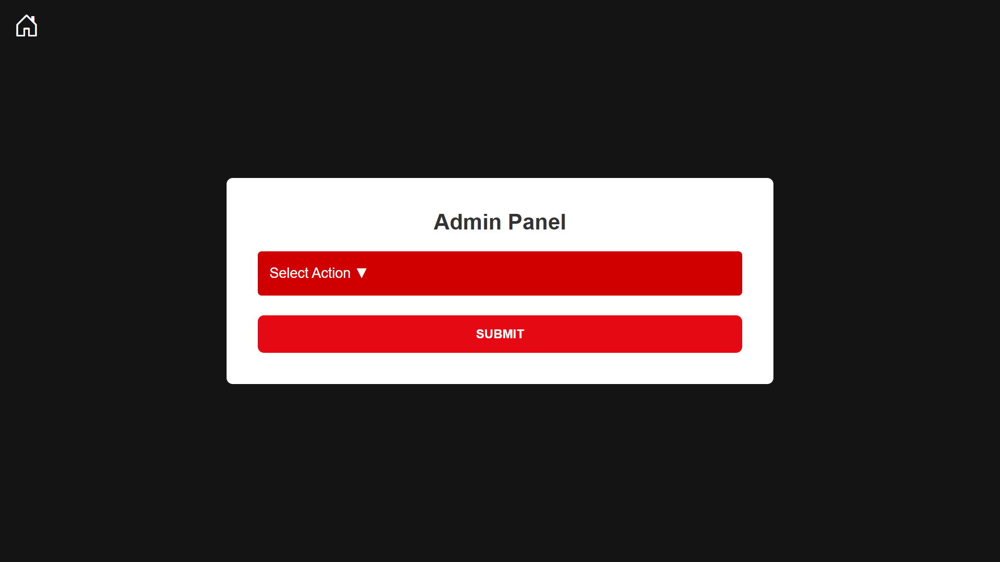
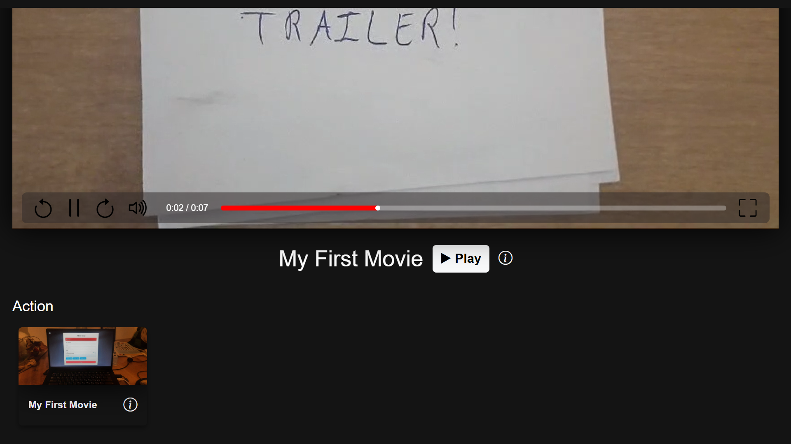
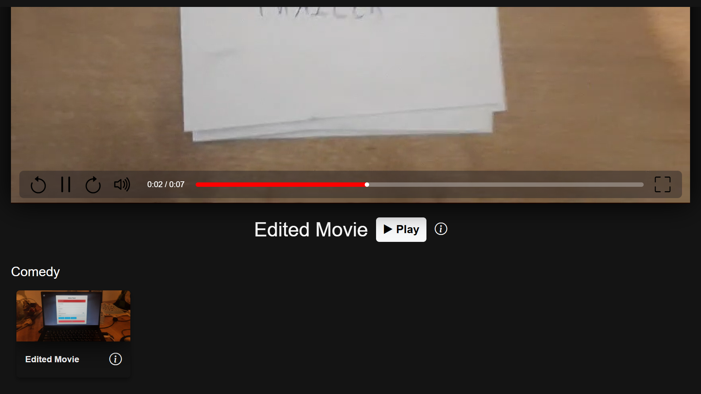
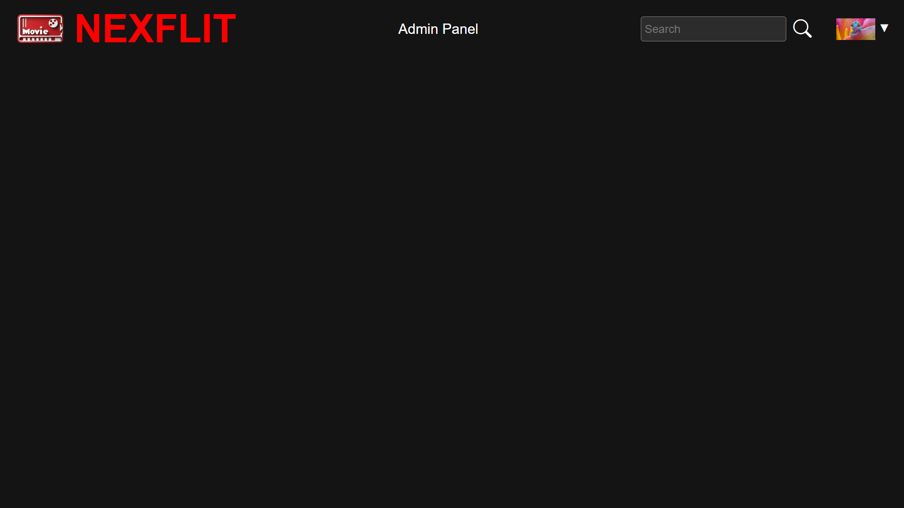
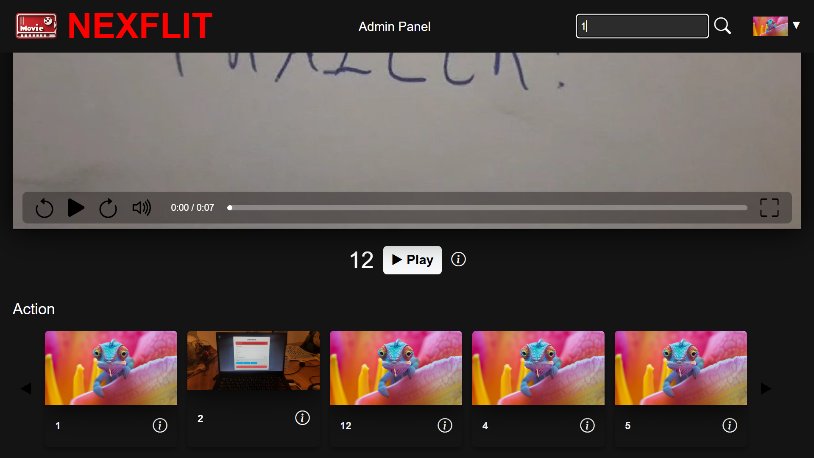
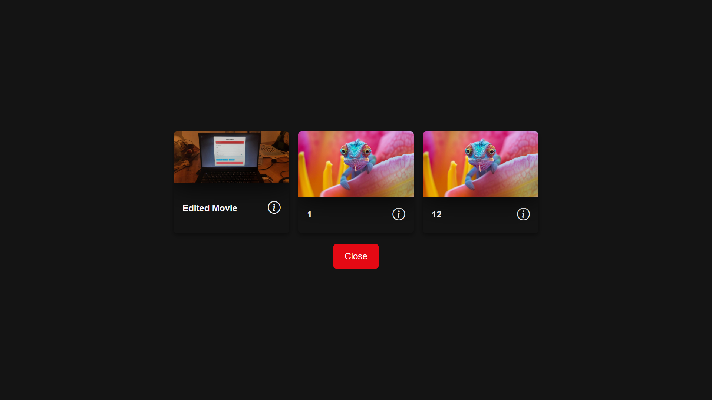

# Admins
In order to add, edit, or delete movies or categories, you must be an admin. To become an admin you need to manually change your user to an admin. To do that, Install MongoDBCompass and connect to the database with your IP. Then, change the `isAdmin` field to `true` under db -> users:

and click on 'Update'. Once you did that, you will need to re-log to the website. Hover over your profile picture and press the 'logout' button to log out and be smoothly redirected back to the login page:

After you log in again you will see the 'Admin Panel' button in the top navigation bar (the navigation bar hides when you scroll down and shows when you scroll up):

And when you click on it you will be redirected to the admin panel:

You can choose to perform any of these admin actions:

# Adding Categories and Movies
In order to add a movie, you first need to add at least one category:

Be sure to make it promoted if you want it to appear in the home page :)

Now we can add movies!
Choose the 'add movie' option, and fill in the details:

# Home Page
We can now go back to the home page and see our movie:

Here we'll see all of the promoted categories and their movies. The last category will be movies that you watched. Our movie is currently the only movie, so it was also chosen as the featured movie and we see its trailer at the top of the page. Unfortunately, we were unable to make the trailer play automatically without muting it due to internet browser limitations.

## Note
Our website has some small cool animations to the buttons, cards and more! We urge you to go and see for yourself :)

# Movie Information Page
Now you can press the `i` below the movie and see its trailer and info:

In this window we also get recommendations, based on the movie and what other users watched. Currently there are no other users, so we do not get any recommendations.

## The Recommendation Algorithm
The recommendation algorithm calculates a relevance value to each movie, excluding movies that the user already watched and the movie that we are now looking at (in the info page). The 10 most relevant movies are showed in descending order of relevance.
Each user is assigned a "Movies in Common" (MIC) value - how many movies both them and the logged-in user watched. The relevance of a movie is then calculated as the sum of the MIC values of all the users who have watched both that movie and the movie we're looking at.

# Movie Watch Page
If we click the 'Play Movie' button we will be redirected to the movie page:

You can pause, play, seek 10 seconds forwards or backwards, mute or change the volume and go to fullscreen mode. You can also press the video itself to pause and play, or press the progress bar to go to a specific time in the video.

You can ofcourse also go back to the home page by pressing the house icon in the corner.

In fullscreen mode, the video controls will disappear when you don't hover over them.

Once you've watched a movie, it will be moved to the 'Watch it again' category:

# Other Admin Actions

## Editing a Movie
We can edit the movie:

You need to copy the movie's ID from MongoDBCompass, since there could be two movies with the same name. You then need to fill in all of the new details, and the movie will change:

## Editing a Category
You can also edit a category:

## Deleting a Movie
In the Admin panel you can also delete a movie:

And now there are no movies again:

## Deleting a Category
When deleting a category:

All of the movies that have that category will no longer have it. Now our movie has no categories, but you can edit it to add other categories.

# Searching
You can also search for movies, and even find movies that don't have promoted categories. This searches through all of the movies and all of their fields:

Also, a category with too many movies have arrows that scroll horizontally to reveal more movies.