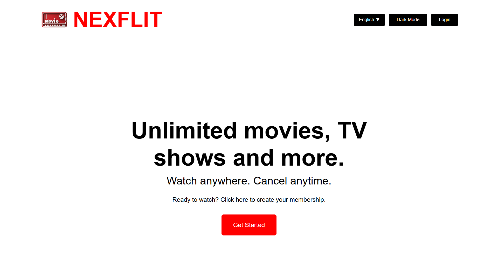
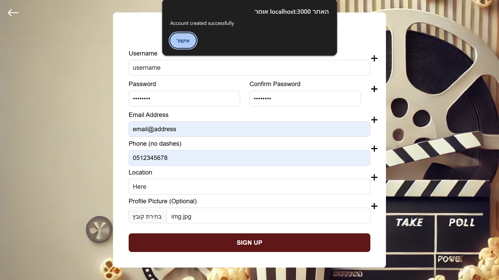
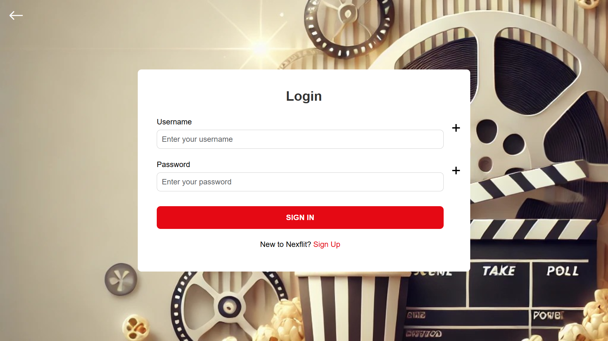

# Guest Page
When first opening the website you will be presented with our guest home page:

You can switch the theme if you'd like:

Or change the language. You can also choose to either sign up or log in.

# Signing up
This is the sign-up page:

You need to choose your username and a strong password, enter you information, and you can also upload a profile picture if you want.

After signing up, you will be notified that your account has been successfully created, and you'll be transfered to the login page.

# Logging in
This is the log-in page:

Enter your correct username and password to be redirected to the home page.
Since you haven't added any movies, the home page will be empty. To learn about that, see [Movies.md](Movies.md).

Once in the home page, you can also choose to log out with the button in the navigation bar.